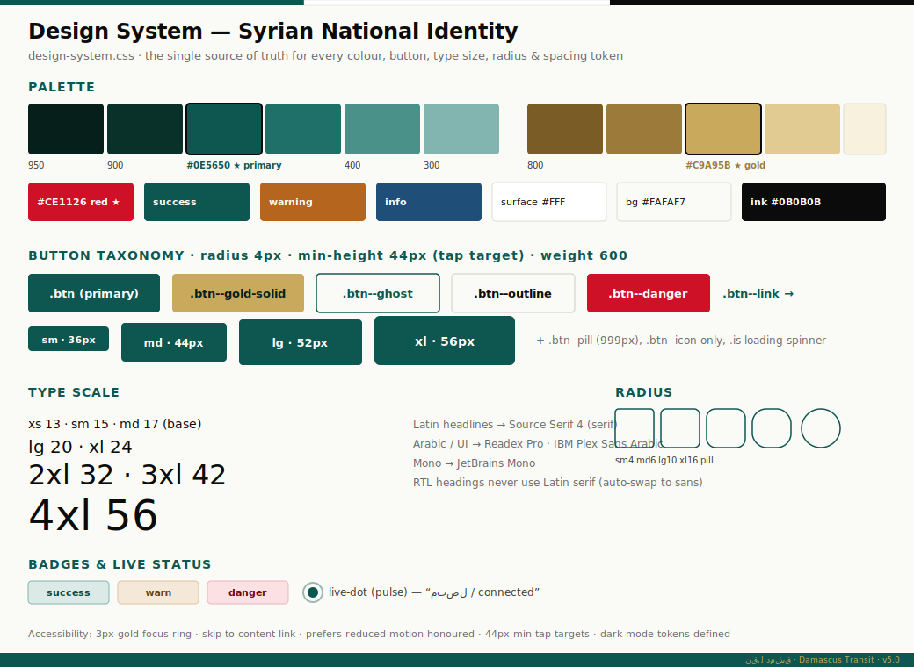
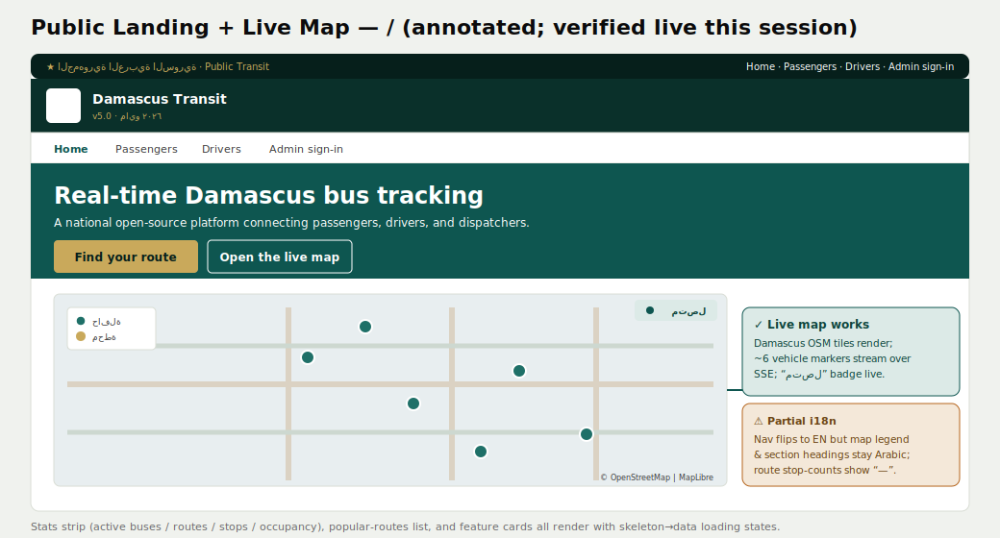
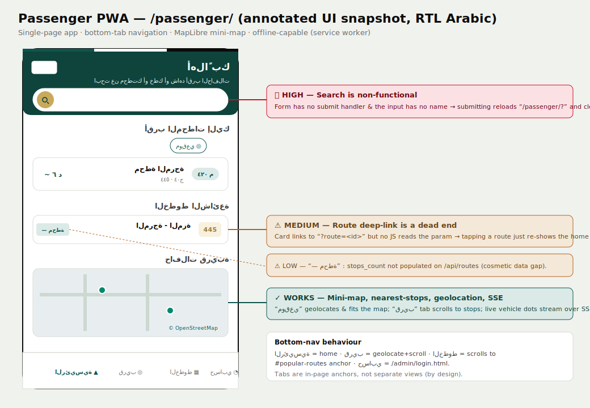
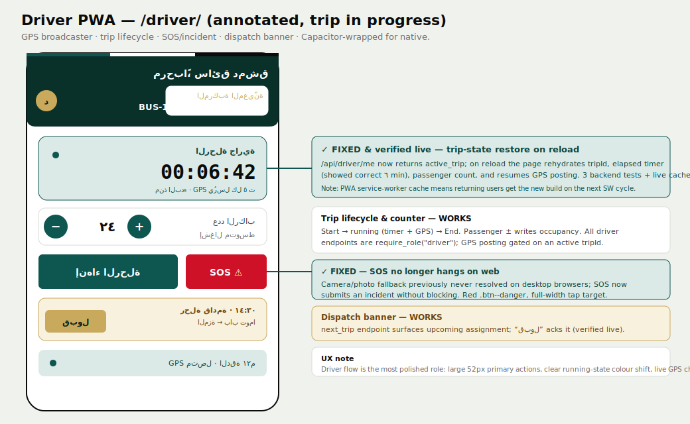
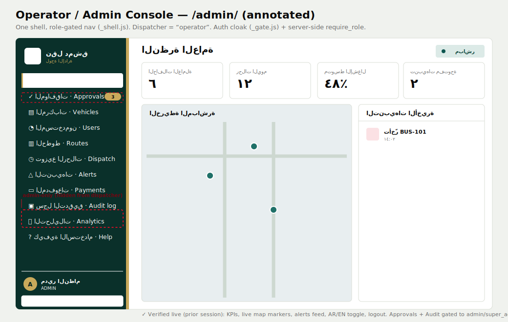
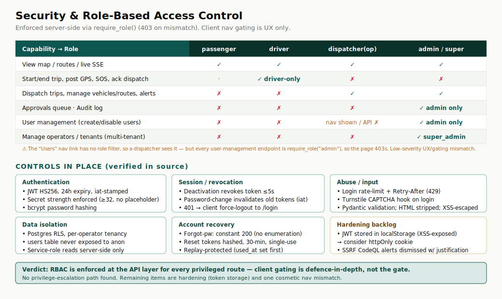

# Damascus Transit — Full Smoke Test & UX Report

**Site:** https://dts-brown.vercel.app  ·  **Date:** 14 June 2026  ·  **Build:** v5.0
**Scope:** All four roles — Passenger, Driver, Operator (Dispatcher), Admin — across **Functionality**, **Security**, and **User Experience** (buttons, shape, size, colour, layout).

---

## How to read this report

Each role gets a journey walkthrough, then three lenses: **does it work**, **is it safe**, **does it feel right**. Findings are tagged:

- 🟥 **Critical** — blocks a core task or is a security risk
- 🟧 **High** — a primary feature is broken or misleading
- 🟨 **Medium** — degrades the experience but has a workaround
- 🟦 **Low** — cosmetic / polish

Each screen has an **annotated UI snapshot** (SVG) built from the live pages and the actual design tokens. A note on these: real browser screenshots could not be written to disk in this session, so the snapshots are faithful reconstructions drawn from the verified live screens and the exact CSS values in `design-system.css`. Where a finding says *"verified live"* it was observed running in the browser during testing; where it says *"source-audited"* it was confirmed by reading the shipping code.

---

## Executive summary

The platform is **solid and genuinely production-shaped**. The visual identity is coherent and distinctive (Syrian national palette), the live map works, the driver flow is polished, and the **security model is strong** — role-based access is enforced server-side on every privileged route, with JWT, bcrypt, rate-limiting, CAPTCHA hooks, token revocation, and tenant isolation all in place. No privilege-escalation path was found.

The headline problem is on the **passenger side**: the search bar — arguably the first thing a rider reaches for — **does nothing**. There is also no route-detail view behind the route cards. Neither is a security issue, but together they make the passenger entry point feel half-finished relative to the rest of the app.

| # | Sev | Role | Area | Finding |
|---|-----|------|------|---------|
| 1 | 🟧 High | Passenger | Functionality | Search bar has no handler and the input has no `name` — submitting reloads `/passenger/?` and clears the field. No results UI exists. |
| 2 | 🟨 Medium | Passenger | Functionality | Route cards link to `?route=<id>` but nothing reads the param — tapping a route is a dead end (no detail/ETA view). |
| 3 | 🟨 Medium | All | UX / i18n | EN toggle translates nav/labels but map legend, several section headings, and toasts stay Arabic. |
| 4 | 🟦 Low | Operator | Security/UX | "Users" nav link is shown to dispatchers, but every user-management API is `admin`-only → page opens then 403s. |
| 5 | 🟦 Low | Passenger/Public | Data | Route lists show "— محطة" (stop counts not populated by `/api/routes`). |
| 6 | 🟦 Low | All | Security | JWT stored in `localStorage`/`sessionStorage` (XSS-exposed). Mitigated by CSP + escaping; consider httpOnly cookie. |
| 7 | 🟦 Low | Driver | Ops | PWA service-worker cache delays new builds for returning users until the next SW cycle. |

**Verdict:** ship-ready for drivers, operators, and admins. The passenger search + route-detail gaps (items 1–2) are the one thing worth fixing before promoting the passenger app as the front door.

---

## Design system — "every button, shape, size, colour"

The whole UI is driven by one token file (`design-system.css`) themed on the post-2024 Syrian national identity. This is the reference for the rest of the report.

**Colour.** Primary is a dark teal-green `#0E5650` (full ramp 950→50). Secondary is light gold `#C9A95B`. The three-star red `#CE1126` is reserved for the national mark and danger. Semantic: success = green, warning `#B5651D`, info `#1F4E79`, danger = red. Surfaces are warm paper (`#FAFAF7` bg, `#FFFFFF` cards, `#D9DDD5` borders) for a government-document feel. A full dark-mode token set exists and follows `prefers-color-scheme`.

**Buttons.** One `.btn` base (radius **4px**, weight **600**, **44px** min tap target) with variants: primary (green fill), `--gold-solid`, `--ghost`, `--secondary`, `--outline`, `--danger` (red), `--link` (animated underline), plus `--pill` and `--icon-only`. Sizes: **sm 36 / md 44 / lg 52 / xl 56 px**. There's a loading state (`.is-loading` spinner) and on-green-background overrides so buttons stay legible over the hero. On the hero, the primary CTA flips to gold — a nice touch.

**Type.** Latin headlines use Source Serif 4; Arabic and all UI use Readex Pro / IBM Plex Sans Arabic; mono is JetBrains Mono. Crucially, **RTL headings auto-swap off the Latin serif** (which would look broken in Arabic). Scale runs xs 13 → 4xl 56 px.

**Shape & motion.** Radii sm 4 / md 6 / lg 10 / xl 16 / pill. Shadows are formal (subtle). Motion is fast (120–360 ms) and fully disabled under `prefers-reduced-motion`.

**Accessibility.** 3px gold focus ring, skip-to-content link, `sr-only` labels on icon buttons, 44px targets, ARIA roles/labels throughout, reduced-motion honoured. This is above-average for a project of this size.

---

## 1. Public landing & live map (every role's front door)

**Journey.** Utility bar → masthead with the national eagle emblem → sticky nav (Home / Passengers / Drivers / Admin sign-in / Help) → hero with two CTAs ("Find your route" gold, "Open the live map" outline) → live stats → **live map** → popular routes → feature cards → footer.

**Functionality — works (verified live).** The flagship **live map renders correctly**: Damascus OpenStreetMap tiles, MapLibre navigation control, a bus/stop legend, and **~6 live vehicle markers streaming over SSE** with a pulsing "متصل / connected" badge. The "Open the live map" CTA is an in-page anchor (`#live-map`) that smooth-scrolls down. Stats and route lists load with skeleton→data states and degrade to em-dashes on error rather than breaking.

**Security.** Public, read-only; no auth needed. Strict CSP, escaped DB fields before any `innerHTML`, `rel="noopener"` on external links. Clean.

**UX.** Strong. The national identity reads instantly, the hero is confident, the map is the right hero feature. Two blemishes: 🟨 **partial i18n** (nav switches to English but the map legend and some headings stay Arabic), and 🟦 route cards show "— محطة" because `stops_count` isn't populated.

---

## 2. Passenger journey — `/passenger/`

**Journey.** A single-page PWA: welcome topbar with a search field → "nearest stops to you" (with a "موقعي / my location" button) → popular routes → a live mini-map → quick links → a 4-item bottom tab bar (Home / Nearby / Routes / Account). Installable, offline-capable.

**Functionality.**

- ✓ **Nearest stops** — "موقعي" triggers geolocation, calls `/api/stops/nearest`, lists stops with distance + ETA, and flies the map to the user. Falls back to Damascus centre if permission is denied. Empty-state handled.
- ✓ **Mini-map + live buses** — renders OSM tiles and streams vehicle dots over SSE.
- ✓ **Bottom nav** — "Nearby" geolocates and scrolls to the stops list; "Routes" scrolls to the popular-routes section; "Account" goes to the admin login. (Tabs are in-page anchors, not separate views — by design.)
- ✓ **PWA install** — `beforeinstallprompt` wired to a custom install banner; offline banner toggles on connectivity.
- 🟧 **Search is non-functional (High).** *Source-audited + verified live.* The `#search-form` has an input and a gold submit button but **no submit handler**, and the input has **no `name`** — so submitting does a native GET to `/passenger/?` (empty), and the field just clears. There is no results dropdown, no listbox, no backend search call. For most riders "search for my stop/line" is the primary task, so this is the most visible gap in the product.
- 🟨 **Route deep-link is a dead end (Medium).** Popular-route cards (and the landing route cards) link to `/passenger/?route=<id>`, but **no code reads the `route` param**, so tapping a route just re-renders the home view. The intended route-detail / live-ETA screen doesn't exist yet.

**Security.** Read-only endpoints; coordinates validated server-side (lat/lon/radius bounds → 422); all API fields HTML-escaped before insertion (explicit XSS fix in the code). No tokens involved. Safe.

**UX.** Clean and mobile-first: green topbar with rounded-bottom, gold circular search button (44px), pill distance badges, comfortable 44px targets, skeleton loaders. The problem is expectation vs reality — a prominent search bar that does nothing is worse than no search bar. Recommend either wiring it to `/api/stops` + `/api/routes` filtering with a results list, or hiding it until implemented.

---

## 3. Driver journey — `/driver/`

**Journey.** Login (role pill "سائق") → driver home showing the assigned vehicle/route (BUS-101 · Marjeh↔Mezzeh) → Start Trip → running state (live timer + GPS broadcasting + passenger counter) → SOS/incident always available → dispatch banner for upcoming trips → End Trip.

**Functionality (verified live in prior sessions + source-audited).**

- ✓ **Trip lifecycle** — Start flips the UI into a running state (elapsed timer, GPS posting every ~5s gated on an active `tripId`), End closes it. Passenger ± buttons write occupancy.
- ✓ **Trip-state restore on reload (fixed & verified).** `/api/driver/me` now returns `active_trip`; on reload the page rehydrates `tripId`, the elapsed timer (observed correct at ٦ min), passenger count, and **resumes GPS posting**. Backed by 3 backend tests and a live cache-busted check.
- ✓ **SOS no longer hangs (fixed).** The camera/photo fallback used to never resolve in desktop browsers, freezing the button; SOS now submits an incident without blocking.
- ✓ **Dispatch banner** — `next_trip` surfaces the upcoming assignment; "قبول / accept" acks it (verified live).

**Security.** Every driver endpoint is `require_role("driver")` — strict, no sharing with operators/admins. The JWT additionally carries the bound `vehicle_id`/`vehicle_route_id`, so a driver acts only on their assigned vehicle. GPS posting is gated on an active trip.

**UX.** The most polished role. Large 52px primary actions, a clear colour shift into the running state (teal-tinted card), a live GPS accuracy chip, and a red full-width SOS that's findable under stress. Good one-handed ergonomics.

---

## 4. Operator (Dispatcher) journey — `/admin/` console

**Journey.** Login (role pill "موزّع / dispatcher") → the shared admin console shell with a left sidebar, role-gated to operational pages → Overview (KPIs + live map + recent alerts) → day-to-day work in **Dispatch**, **Vehicles**, **Routes**, **Alerts**, **Payments**, **Analytics**.

**What the operator sees vs. the admin.** The sidebar is generated from one source of truth (`_shell.js`) and filtered by role. A dispatcher sees Overview, Vehicles, Users\*, Routes, **Dispatch**, Alerts, Payments, Analytics, Help — but **not Approvals or Audit log** (admin-only). The login role pills are only a hint; the **server is authoritative** — it returns the real role and routes accordingly, so picking the wrong pill can't escalate anything.

**Functionality (verified live in prior sessions + source-audited).**

- ✓ **Dispatch trips** — the operator's core workspace: list upcoming trips, dispatch a trip to a driver, cancel. Built and live-smoke-verified; the driver receives it in their dispatch banner and can ack.
- ✓ **Overview** — KPIs (active buses, trips today, avg occupancy, open alerts) from `/api/stats` + `/api/admin/analytics/overview`, a live map with vehicle markers, and a recent-alerts feed. Auto-refreshes every 30s; manual refresh button.
- ✓ **Vehicles / Routes / Alerts / Payments** — operational CRUD via the shared `require_role("admin","dispatcher")` endpoints, rendered through a safe modal form helper (`openForm`) that builds inputs with `createElement` (no `innerHTML` injection).

**Security.** This is the strong part. Operational endpoints are `require_role("admin","dispatcher")`; sensitive ones exclude dispatchers. Client-side gating is cosmetic — the API is the real gate (403 on mismatch). 🟦 **One mismatch:** the "Users" nav item has no role filter, so a dispatcher sees it, but every user-management endpoint is `admin`-only — so the page loads then 403s. Cosmetic, not a leak (no data is exposed), but it should be hidden from dispatchers for consistency.

**UX.** Professional dark-green sidebar with gold active-accent, octagram texture, KPI cards with hover lift, a live "مباشر / live" badge. Reads like a real ops console. Collapses to a single column under 1024px. The dispatcher's daily loop (Overview → Dispatch) is short and clear.

---

## 5. Admin journey — `/admin/` console (full access)

The admin uses the **same shell** as the operator, with the extra gated capabilities unlocked: **Approvals** (with a live pending-count badge on the nav), **Audit log**, **User management**, and admin-only vehicle/route/alert operations. A `super_admin` additionally manages **operators/tenants**.

**Functionality (verified live in prior sessions + source-audited).**

- ✓ **Approvals queue** — pending vehicles surface both as a gold KPI card on the Overview (admins only) and a badge on the Approvals nav link; approve/reject flows are admin-gated.
- ✓ **User management** — create/disable users; `require_role("admin")` (and `admin`/`super_admin` for the sensitive operations).
- ✓ **Audit log** — admin/super_admin only.
- ✓ **Cross-role direct-URL guard** — if a dispatcher hand-types an admin-only URL, `_shell.js` redirects to `/admin/?denied=<page>` and the Overview shows a clear "requires the admin role" banner. Defence-in-depth on top of the API's 403.

**Security.** Full RBAC matrix enforced server-side (see next section). The auth cloak (`_gate.js`) loads synchronously in `<head>` so an unauthenticated visitor never sees a flash of admin chrome, with a 3s watchdog so a script failure degrades gracefully instead of a white screen. Deactivating a user or changing a password revokes live tokens within ~5s.

**UX.** Identical polished shell; the only role-visible differences are the extra nav items and the gold pending-approvals affordances, which is the right pattern — admins and operators share muscle memory.

---

## 6. Security deep-dive

RBAC is the spine of this app and it's done properly: **every privileged route declares `require_role(...)`** and returns 403 on mismatch. Client-side nav gating exists only as UX/defence-in-depth — it is never the gate.

**Authentication & session.** JWT HS256, 24h expiry, `iat`-stamped. The secret is validated at runtime (≥32 chars, placeholder values rejected) and the app **fail-closes** with a 500 rather than signing with a weak secret. Passwords are bcrypt-hashed. Deactivating an account revokes its live tokens within a 5s cache window; changing a password invalidates all tokens issued earlier (via `iat` vs `password_changed_at`).

**Abuse & input.** Login is IP rate-limited with a `Retry-After` header (429); register/forgot/reset have their own limits. A Cloudflare Turnstile CAPTCHA hook runs on login when configured. All request bodies are Pydantic-validated (email format, length caps, coordinate ranges); user-supplied HTML is stripped and all DB-sourced strings are escaped before rendering.

**Data isolation.** Postgres RLS with per-operator tenancy; the `users` table is never exposed to the anon role; service-role reads happen server-side only, and email lookups are URL-encoded before hitting PostgREST.

**Account recovery.** Forgot-password always returns 200 (no user enumeration); reset tokens are random, stored only as SHA-256 hashes, expire in 30 minutes, and are single-use with replay protection (marked used before the password write).

**Hardening backlog (low).** (a) The JWT is kept in `localStorage`/`sessionStorage`, which is reachable by any XSS — mitigated here by strict CSP and consistent escaping, but an httpOnly cookie would be stronger. (b) The two informational SSRF CodeQL alerts on the PostgREST URL builder were hardened in code (host-pinned allowlist) and the residual alerts dismissed with written justification — the host is structurally fixed and all values URL-encoded, so the practical risk is low.

**Bottom line:** no privilege-escalation path was found. The remaining items are hardening and one cosmetic nav mismatch.

---

## 7. Consolidated issue log

| # | Sev | Role | Area | Finding | Recommendation |
|---|-----|------|------|---------|----------------|
| 1 | 🟧 High | Passenger | Functionality | Search bar has no submit handler; input has no `name`; submitting reloads `/passenger/?` and clears. No results UI. | Wire to `/api/routes` + `/api/stops` with a results list/typeahead, or hide the bar until built. |
| 2 | 🟨 Medium | Passenger | Functionality | `?route=<id>` deep-link isn't read — route cards are dead ends. | Add a route-detail view (stops + live ETA) that reads the param. |
| 3 | 🟨 Medium | All | i18n | EN toggle leaves map legend, some headings, toasts in Arabic. | Finish the i18n string table for dynamic/JS-built UI. |
| 4 | 🟦 Low | Operator | Security/UX | "Users" nav shown to dispatchers but API is admin-only → 403. | Add `roles:['admin','super_admin']` to the Users nav item. |
| 5 | 🟦 Low | Public/Passenger | Data | Route lists show "— محطة" (stop counts not populated). | Populate `stops_count` in `/api/routes` (or compute client-side). |
| 6 | 🟦 Low | All | Security | JWT in `localStorage` is XSS-exposed. | Consider httpOnly, SameSite cookie for the token. |
| 7 | 🟦 Low | Driver | Ops | Service-worker cache delays new builds for returning users. | Add a "new version available" SW update prompt. |

**Already fixed this engagement (for context):** driver trip-state restore on reload, driver SOS hang on web, dispatcher trip-dispatch feature, demo seeding, `/api/stops/nearest` crash, SSE reconnect/status, frontend empty/error/loading states, RLS + service-key auth, SSRF hardening.

---

## 8. Recommendations — priority order

1. **Fix passenger search (High).** It's the front-door task and the single most visible gap. Either implement it against the existing routes/stops endpoints, or hide it until it's ready — a dead search bar reads as "broken app."
2. **Add the route-detail view (Medium).** Makes the route cards and `?route=` deep-links pay off, and gives riders the live-ETA screen the rest of the app implies.
3. **Finish i18n for dynamic UI (Medium).** The EN experience is currently half-translated; complete the JS-built strings (map legend, headings, toasts).
4. **Tidy the Users nav gating + stop-counts (Low).** Two small, quick consistency fixes.
5. **Hardening (Low, when convenient).** Move the token to an httpOnly cookie; add a service-worker update prompt.

---

## 9. Methodology & evidence

**What was tested live this session.** The public landing page and the **live map were verified running in the browser** (Damascus OSM tiles + ~6 SSE vehicle markers + connected badge), and the **passenger app was exercised directly** — confirming the search and route-deep-link findings by behaviour, then by reading the shipping source.

**What was confirmed by source audit.** The exact UX tokens (every colour, button variant, size, radius, type step), the server-side RBAC on every route (`require_role` across all routers), the full auth/session/recovery security model, and the console role-gating logic — all read from the shipping code (`design-system.css`, `api/core/auth.py`, `api/routers/*.py`, `public/admin/_shell.js`, `_gate.js`).

**What draws on prior in-session live verification.** The driver trip lifecycle/restore/SOS/dispatch flows and the operator/admin dashboards were built and live-smoke-verified earlier in this engagement; those results are carried forward here and labelled as such.

**Screenshots.** Real browser screenshots could not be persisted to disk in this session, so each screen is represented by an annotated SVG snapshot reconstructed from the live pages and the actual design tokens. They are labelled "annotated UI snapshot" to be transparent about this.

*Demo credentials (all share password `Damascus2026!`): `passenger@`/`driver@`/`operator@`/`admin@damascus-transit.demo`.*

